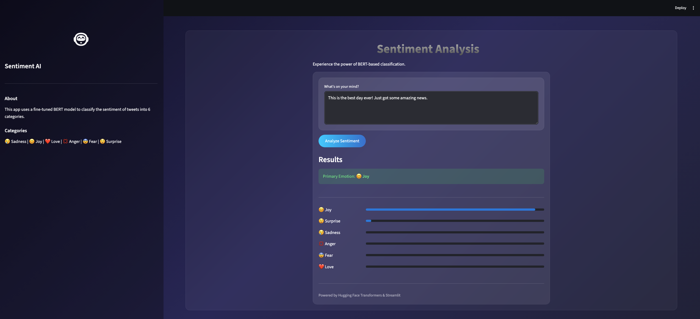
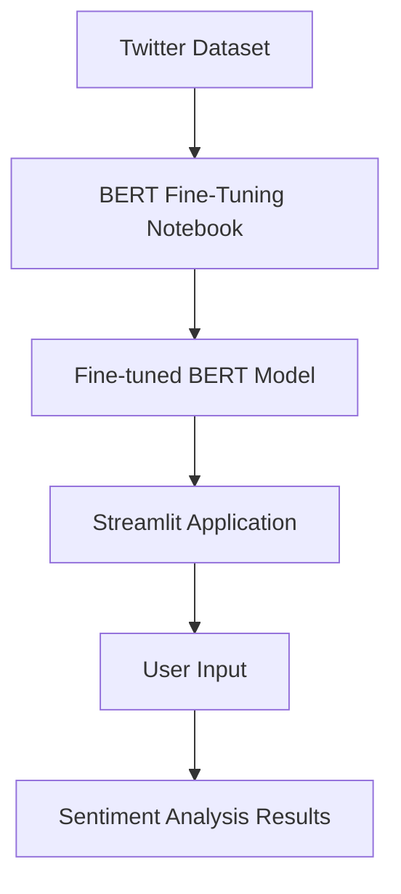

# Multi-Class Sentiment Classification for Twitter Tweets



This project implements a multi-class sentiment analysis system for Twitter tweets using Hugging Face Transformers. It includes a fine-tuned BERT model and a Streamlit web application for real-time inference.

## System Architecture



## Project Structure

- `Fine_Tuning_BERT_for_Multi_Class_Sentiment_Classification_for_Twitter_Tweets.ipynb`: Jupyter notebook containing the full pipeline for data preprocessing, model fine-tuning (BERT), and evaluation.
- `app.py`: A Streamlit-based web application providing a user-friendly interface for sentiment prediction.
- `streamlit-app.png`: A screenshot showing the application's user interface.

## Key Components

### 1. Model Training & Fine-Tuning
The project fine-tunes a `bert-base-uncased` model for multi-class classification across 6 sentiment categories:
- 😢 Sadness
- 😊 Joy
- ❤️ Love
- 💢 Anger
- 😨 Fear
- 😲 Surprise

### 2. Streamlit Application
A modern, glassmorphism-inspired web interface that allows users to:
- Input custom tweet text.
- Visualize sentiment scores across all categories.
- Identify the primary emotion with high-confidence predictions.

## Quick Start

### Training
Open the `.ipynb` notebook in Google Colab or a local Jupyter environment to train or inspect the model fine-tuning process.

### Inference App
To run the Streamlit dashboard locally:
```bash
streamlit run app.py
```
*Note: Ensure you have the `transformers`, `torch`, and `streamlit` packages installed.*
