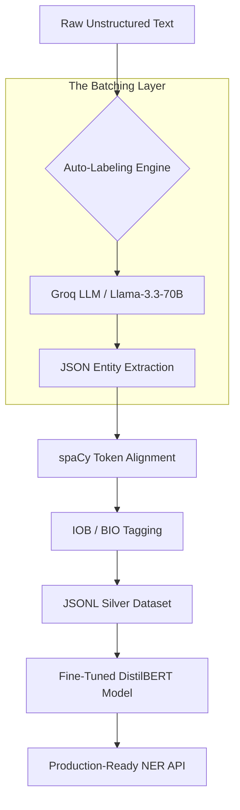

# Restaurant Search NER: DistilBERT Fine-Tuning with Auto-Labeling

This project demonstrates a state-of-the-art Named Entity Recognition (NER) pipeline that transitions from manual dataset reliance to **Automatic Silver Dataset Generation** using Large Language Models (LLMs) via the Groq API.

## 🏗️ Architectural Overview

The system architecture is designed to handle raw, unstructured text and transform it into a format ready for Transformer-based fine-tuning.



## 🚀 Key Innovation: Auto-Labeling & Mapping

The updated implementation (`NER_Recognition_By_Fine_Tuning_DistilBERT_Updated.ipynb`) introduces a revolutionary way to handle the **data labeling bottleneck**.

### 1. Smart Extraction
Instead of manual tagging, we leverage **Llama-3.3-70B** to identify entities. The model is prompted to return structured JSON:
`[{"entity": "Elon Musk", "label": "PER"}]`

### 2. Dynamic Token Alignment
Tokenization must be consistent between the LLM extraction and the BERT model. We use **spaCy** as the ground-truth tokenizer to align the LLM's identified entities with word-level indices, producing valid **IOB (Inside-Outside-Beginning)** tags.

### 3. High-Performance Batching
The system processes text in batches (e.g., 15 sentences per request).

| Feature | Individual Processing | Batched Processing (Optimized) |
| :--- | :--- | :--- |
| **Speed** | Slow (1 req per sentence) | **Fast (1 req per 15 sentences)** |
| **Rate Limits** | Hits limits quickly | **Maximizes token-per-minute (TPM)** |
| **Cost** | High overhead | **Efficient resource utilization** |
| **Consistency** | High variability | **Contextual consistency across batch** |

## 🛠️ Tech Stack

*   **Model**: [DistilBERT](https://huggingface.co/distilbert-base-uncased) (Efficient, fast, and accurate)
*   **LLM Engine**: [Groq API](https://groq.com/) (Ultra-fast inference)
*   **NLP Tools**: [spaCy](https://spacy.io/), [Hugging Face Transformers](https://huggingface.co/docs/transformers/index)
*   **Frameworks**: [Datasets](https://huggingface.co/docs/datasets/index), [Accelerate](https://huggingface.co/docs/accelerate/index)

## 🦇 The NER Agent (`app.py`)

The **NER AGENT** is a production-grade Streamlit application designed for rapid, autonomous data labeling. It streamlines the creation of high-quality "Silver Datasets" from raw, unstructured text files, specifically optimized for fine-tuning DistilBERT models.

### 🌟 High-Level Features
- **Batman Theme (Dark Knight Vibe)**: A sleek, high-contrast dark UI for a focused developer experience.
- **Autonomous Labeling**: Leverages the high-reasoning capabilities of `Llama-3.3-70B-Versatile` via the Groq API to detect complex entities.
- **Smart Token Alignment**: Uses spaCy to synchronize LLM outputs with precise word-level IOB (Inside-Outside-Beginning) tagging.
- **Bat-Cave Batching**: Processes sentences in groups to maximize API throughput and respect rate limits automagically.
- **One-Click Dataset Export**: Instantly export processed data into `.jsonl` format, ready for the Hugging Face `datasets` library.

### 📸 Application Preview


*Initial setup and Bat-Signal themed UI.*


*Batch processing and JSONL generation in action.*


### 🔄 Model-Ready Dataset Loading

Once your processing is complete, you can instantly load your labeled data into the Hugging Face ecosystem for fine-tuning with a single line of code:

```python
from datasets import load_dataset

# Load your autonomous silver dataset
dataset = load_dataset('json', data_files='model_ready_data.jsonl')
```

---

> [!TIP]

> **Why DistilBERT?**
> DistilBERT retains 97% of BERT's performance while being 40% smaller and 60% faster, making it ideal for real-time restaurant search applications.

> [!IMPORTANT]
> This pipeline transforms raw `.txt` files into `model_ready_data.jsonl` in minutes, saving weeks of manual work.
