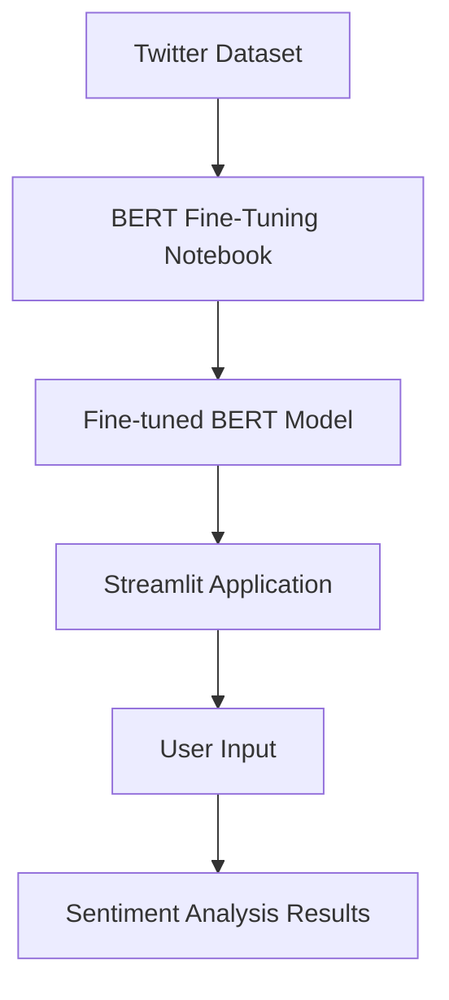
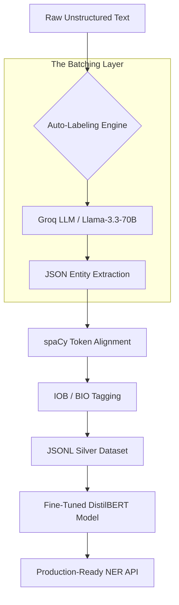
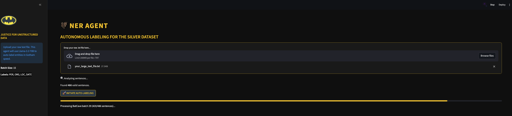
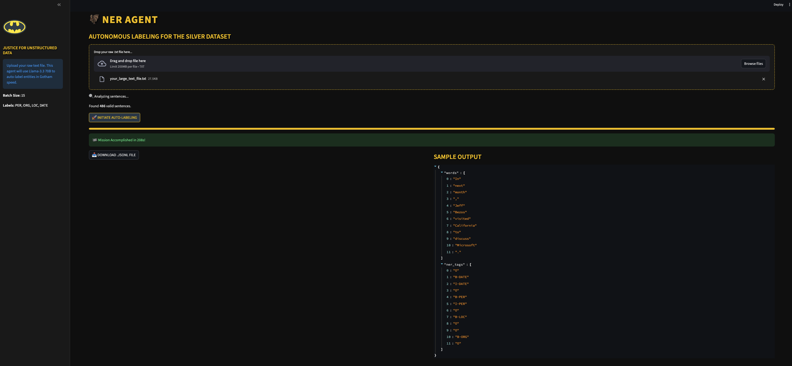

# Fine-Tuning LLMs with Hugging Face Transformers

This repository contains various projects focused on fine-tuning Large Language Models (LLMs) and Vision Transformers (ViTs) for NLP and Computer Vision tasks using the Hugging Face ecosystem.

## Table of Contents

1. [Multi-Class Sentiment Classification for Twitter Tweets](#multi-class-sentiment-classification-for-twitter-tweets)
2. [Fake News Detection with TinyBERT and Hierarchical Attention](#fake-news-detection-with-tinybert-and-hierarchical-attention)
3. [Restaurant Search NER: DistilBERT Fine-Tuning with Auto-Labeling](#restaurant-search-ner-distilbert-fine-tuning-with-auto-labeling)
4. [Fine-Tuning T5 for Custom Summarization](#fine-tuning-t5-for-custom-summarization)
5. [Fine-Tuning ViT for Indian Foods Classification](#fine-tuning-vit-for-indian-foods-classification)

---

## 1. Multi-Class Sentiment Classification for Twitter Tweets


This project implements a multi-class sentiment analysis system for Twitter tweets using Hugging Face Transformers. It includes a fine-tuned BERT model and a Streamlit web application for real-time inference.

### System Architecture



### Project Structure

- `Fine_Tuning_BERT_for_Multi_Class_Sentiment_Classification_for_Twitter_Tweets.ipynb`: Jupyter notebook containing the full pipeline for data preprocessing, model fine-tuning (BERT), and evaluation.
- `app.py`: A Streamlit-based web application providing a user-friendly interface for sentiment prediction.
- `streamlit-app.png`: A screenshot showing the application's user interface.

### Key Components

#### 1. Model Training & Fine-Tuning
The project fine-tunes a `bert-base-uncased` model for multi-class classification across 6 sentiment categories:
- 😢 Sadness
- 😊 Joy
- ❤️ Love
- 💢 Anger
- 😨 Fear
- 😲 Surprise

#### 2. Streamlit Application
A modern, glassmorphism-inspired web interface that allows users to:
- Input custom tweet text.
- Visualize sentiment scores across all categories.
- Identify the primary emotion with high-confidence predictions.

### Quick Start

#### Training
Open the `.ipynb` notebook in Google Colab or a local Jupyter environment to train or inspect the model fine-tuning process.

#### Inference App
To run the Streamlit dashboard locally:
```bash
streamlit run app.py
```
*Note: Ensure you have the `transformers`, `torch`, and `streamlit` packages installed.*

---

## 2. Fake News Detection with TinyBERT and Hierarchical Attention

This project explores various strategies for fine-tuning transformer models—specifically **TinyBERT**, **DistilBERT**, and **MobileBERT**—for the task of fake news detection. A primary challenge addressed is the classification of long text documents that exceed the standard 512-token limit of BERT models.

### Project Structure

- `Fine_Tuning_DistilBERT_MobileBERT_TinyBERT_For_Fake_News_Detection.ipynb`: Baseline notebook comparing multiple lightweight transformer models using standard truncation.
- `Fine_Tuning_TinyBERT_For_Fake_News_Detection_text.ipynb`: focused implementation of **TinyBERT** on body text using a **Chunking with Mean Pooling** strategy.
- `Fine_Tuning_TinyBERT_For_Fake_News_Detection_text_hierarchical.ipynb`: advanced implementation of **Hierarchical Attention** for long-document classification.
- `Fine_Tuning_TinyBERT_For_Fake_News_Detection_Merged.ipynb`: merged implementation potentially combining title and text features.

---

### 1. Summary of Architectural Approaches

| Approach | Implementation File | Model(s) | Input | Handling of Long Text |
| :--- | :--- | :--- | :--- | :--- |
| **Multi-Model Baseline** | [Baseline Notebook](2_Fine_Tuning_DistilBERT_MobileBERT_TinyBERT_For_Fake_News_Detection/Fine_Tuning_DistilBERT_MobileBERT_TinyBERT_For_Fake_News_Detection.ipynb) | DistilBERT, MobileBERT, TinyBERT | `text` | **Truncation**: Only uses the first 512 tokens. |
| **Mean Pooling** | [TinyBERT Text Notebook](2_Fine_Tuning_DistilBERT_MobileBERT_TinyBERT_For_Fake_News_Detection/Fine_Tuning_TinyBERT_For_Fake_News_Detection_text.ipynb) | TinyBERT | `text` | **Mean Logit Aggregation**: Document split into chunks; predictions are averaged. |
| **Hierarchical Attention**| [Hierarchical Notebook](2_Fine_Tuning_DistilBERT_MobileBERT_TinyBERT_For_Fake_News_Detection/Fine_Tuning_TinyBERT_For_Fake_News_Detection_text_hierarchical.ipynb) | TinyBERT | `text` | **Attention Aggregation**: Global pooling of chunk-level [CLS] embeddings. |

---

### 2. Deep Dive: Hierarchical Attention vs. Mean Pooling

The **Hierarchical Attention Implementation** represents the most advanced solution in this repository for processing long documents (up to 9,000+ tokens).

#### How Hierarchical Attention Works:
1.  **Chunking**: The document is split into overlapping chunks (stride=50).
2.  **Local Encoding**: Each chunk is passed through TinyBERT to extract a **312-dimensional [CLS] embedding**.
3.  **Global Aggregation**: An **Attention Layer** calculates an importance score (weight) for each chunk. 
4.  **End-to-End Training**: Loss is calculated at the document level, allowing the model to learn which parts of the text matter most.

#### Key Advantages:

| Feature | Mean Pooling (Logit-Level) | Hierarchical Attention (Embedding-Level) |
| :--- | :--- | :--- |
| **Aggregation** | **Late Fusion**: Only final 2-dim predictions are averaged. | **Mid-Fusion**: Rich 312-dim features are combined. |
| **Weighting** | **Uniform**: All chunks are treated as equally important. | **Dynamic**: Focuses on "fake news signals" and ignores noise. |
| **Context** | **Low**: Chunks are treated independently until the end. | **High**: Sequence of embeddings is treated as a coherent story. |

---

### 3. Comparison with Title-Only Solutions

Solutions that consider **only the title** or **truncate the text** suffer from major biases:
-   **Missing Signal**: Fake news often hides misinformation deep within the body text.
-   **Limited Evidence**: Deceptive titles are common; the falsehoods often appear later in the article.
-   **Length Bias**: Truncation penalizes detailed reporting by cutting off nuances.

**Hierarchical Attention** performs better by "scanning" the entire text and using the most relevant segments for high-fidelity classification. 

---

### 4. Key Engineering Optimizations
-   **Differential Learning Rates**: Lower LR (2e-5) for pre-trained weights, higher LR (1e-4) for attention layers.
-   **Memory Efficiency**: Uses **Gradient Checkpointing** and **Mixed Precision (FP16)** for document-level training.
-   **Chunk-Level Masking**: Ensures the attention mechanism ignores padded chunks in variable-length documents.

### Model Performance Comparison

The following table summarizes the test accuracy for each architectural approach. Note that the results for chunking strategies (Mean Pooling and Hierarchical Attention) are aggregated at the document level.

| Approach | Model | Accuracy | F1-Score |
| :--- | :--- | :---: | :---: |
| **Hierarchical Attention** | TinyBERT | **99.48%** | **0.99** |
| **Merged Features (Title + Text)** | TinyBERT | 99.10% | 0.99 |
| **Mean Pooling (Text only)** | TinyBERT | 98.66% | 0.99 |
| **Truncation Baseline** | Multi-Model | 95.82% | 0.96 |

---

### Detailed Test Results

#### 1. Hierarchical Attention (SOTA)
*File: `Fine_Tuning_TinyBERT_For_Fake_News_Detection_text_hierarchical.ipynb`*

```text
Test Loss: 0.0322
Test Accuracy: 0.9948

Classification Report:
              precision    recall  f1-score   support

        Real       0.99      1.00      1.00      2072
        Fake       1.00      0.99      0.99      1584

    accuracy                           0.99      3656
   macro avg       0.99      0.99      0.99      3656
weighted avg       0.99      0.99      0.99      3656
```

#### 2. Merged Features (Title + Text with Mean Pooling)
*File: `Fine_Tuning_TinyBERT_For_Fake_News_Detection_Merged.ipynb`*

```text
Results for 3656 unique documents:
              precision    recall  f1-score   support

        Real       0.98      1.00      0.99      2072
        Fake       1.00      0.97      0.98      1584

    accuracy                           0.99      3656
   macro avg       0.99      0.99      0.99      3656
weighted avg       0.99      0.99      0.99      3656
```

#### 3. Mean Pooling (Text Only)
*File: `Fine_Tuning_TinyBERT_For_Fake_News_Detection_text.ipynb`*

```text
Results for 3656 unique documents:
              precision    recall  f1-score   support

        Real       0.98      1.00      0.99      2072
        Fake       1.00      0.97      0.99      1584

    accuracy                           0.99      3656
   macro avg       0.99      0.99      0.99      3656
weighted avg       0.99      0.99      0.99      3656
```

#### 4. Truncation Baseline
*File: `Fine_Tuning_DistilBERT_MobileBERT_TinyBERT_For_Fake_News_Detection.ipynb`*

```text
Classification Report for Aggregated Predictions:
              precision    recall  f1-score   support

        Real       0.96      0.97      0.96      2072
        Fake       0.96      0.94      0.95      1584

    accuracy                           0.96      3656
   macro avg       0.96      0.96      0.96      3656
weighted avg       0.96      0.96      0.96      3656
```

### Installation and Requirements

```bash
pip install -U transformers accelerate datasets seaborn openpyxl tqdm
```

### Performance Highlights
The **Hierarchical Attention** model offers superior accuracy on long articles (70%+ of the dataset) compared to simpler truncation-based methods.

---

## 3. Restaurant Search NER: DistilBERT Fine-Tuning with Auto-Labeling

This project demonstrates a state-of-the-art Named Entity Recognition (NER) pipeline that transitions from manual dataset reliance to **Automatic Silver Dataset Generation** using Large Language Models (LLMs) via the Groq API.

### 🏗️ Architectural Overview

The system architecture is designed to handle raw, unstructured text and transform it into a format ready for Transformer-based fine-tuning.



### 🚀 Key Innovation: Auto-Labeling & Mapping

The updated implementation (`NER_Recognition_By_Fine_Tuning_DistilBERT_Updated.ipynb`) introduces a revolutionary way to handle the **data labeling bottleneck**.

#### 1. Smart Extraction
Instead of manual tagging, we leverage **Llama-3.3-70B** to identify entities. The model is prompted to return structured JSON:
`[{"entity": "Elon Musk", "label": "PER"}]`

#### 2. Dynamic Token Alignment
Tokenization must be consistent between the LLM extraction and the BERT model. We use **spaCy** as the ground-truth tokenizer to align the LLM's identified entities with word-level indices, producing valid **IOB (Inside-Outside-Beginning)** tags.

#### 3. High-Performance Batching
The system processes text in batches (e.g., 15 sentences per request).

| Feature | Individual Processing | Batched Processing (Optimized) |
| :--- | :--- | :--- |
| **Speed** | Slow (1 req per sentence) | **Fast (1 req per 15 sentences)** |
| **Rate Limits** | Hits limits quickly | **Maximizes token-per-minute (TPM)** |
| **Cost** | High overhead | **Efficient resource utilization** |
| **Consistency** | High variability | **Contextual consistency across batch** |

### 🛠️ Tech Stack

*   **Model**: [DistilBERT](https://huggingface.co/distilbert-base-uncased) (Efficient, fast, and accurate)
*   **LLM Engine**: [Groq API](https://groq.com/) (Ultra-fast inference)
*   **NLP Tools**: [spaCy](https://spacy.io/), [Hugging Face Transformers](https://huggingface.co/docs/transformers/index)
*   **Frameworks**: [Datasets](https://huggingface.co/docs/datasets/index), [Accelerate](https://huggingface.co/docs/accelerate/index)

### 🦇 The NER Agent (`app.py`)

The **NER AGENT** is a production-grade Streamlit application designed for rapid, autonomous data labeling. It streamlines the creation of high-quality "Silver Datasets" from raw, unstructured text files, specifically optimized for fine-tuning DistilBERT models.

#### 🌟 High-Level Features
- **Batman Theme (Dark Knight Vibe)**: A sleek, high-contrast dark UI for a focused developer experience.
- **Autonomous Labeling**: Leverages the high-reasoning capabilities of `Llama-3.3-70B-Versatile` via the Groq API to detect complex entities.
- **Smart Token Alignment**: Uses spaCy to synchronize LLM outputs with precise word-level IOB (Inside-Outside-Beginning) tagging.
- **Bat-Cave Batching**: Processes sentences in groups to maximize API throughput and respect rate limits automagically.
- **One-Click Dataset Export**: Instantly export processed data into `.jsonl` format, ready for the Hugging Face `datasets` library.

#### 📸 Application Preview


*Initial setup and Bat-Signal themed UI.*


*Batch processing and JSONL generation in action.*


#### 🔄 Model-Ready Dataset Loading

Once your processing is complete, you can instantly load your labeled data into the Hugging Face ecosystem for fine-tuning with a single line of code:

```python
from datasets import load_dataset

# Load your autonomous silver dataset
dataset = load_dataset('json', data_files='model_ready_data.jsonl')
```

---

> [!TIP]
> **Why DistilBERT?**
> DistilBERT retains 97% of BERT's performance while being 40% smaller and 60% faster, making it ideal for real-time restaurant search applications.

> [!IMPORTANT]
> This pipeline transforms raw `.txt` files into `model_ready_data.jsonl` in minutes, saving weeks of manual work.

---

## 4. Fine-Tuning T5 for Custom Summarization

This project demonstrates the process of fine-tuning the T5 (Text-to-Text Transfer Transformer) model for abstractive text summarization. It transitions from using pre-trained baselines on news articles to fine-tuning a custom model on dialogue-based data.

### 🚀 Project Overview

The objective is to leverage the power of the T5 architecture to generate concise, human-like summaries. The project walks through:
1. **Baseline Evaluation**: Testing pre-trained `t5-small` and `BART` models on the CNN/DailyMail dataset.
2. **Custom Fine-Tuning**: Adapting `t5-small` specifically for conversation summarization using the DialogSum dataset.
3. **Inference**: Deploying the fine-tuned model for real-world summarization tasks using Hugging Face Pipelines.

### 📊 Datasets

- **CNN/DailyMail**: A large-scale dataset of news articles used for initial baseline testing. It focuses on well-structured journalistic text.
- **DialogSum (samsum)**: A dataset containing human-annotated dialogues and their summaries. This is used for fine-tuning to handle the nuances of conversational language.

### 🛠️ Workflow Architecture

The notebook follows a structured pipeline:

#### 1. Environment Setup
Installation of essential libraries including `transformers`, `datasets`, `accelerate`, and `sentencepiece`.

#### 2. Exploratory Analysis
- Loading the `cnn_dailymail` and `dialogsum` datasets.
- Visualizing distributions of dialogue and summary lengths to determine optimal padding and truncation strategies.

#### 3. Baseline Comparison
Running zero-shot summarization using:
- `ubikpt/t5-small-finetuned-cnn`
- `facebook/bart-large-cnn`

#### 4. Data Preprocessing
- Tokenization using `AutoTokenizer` for `t5-small`.
- Formatting the input prefix as `"summarize: "` (standard for T5).
- Managing attention masks and label IDs for sequence-to-sequence training.

#### 5. Fine-Tuning
- **Model**: `t5-small` (Seq2Seq architecture).
- **Optimizer**: AdamW with weight decay.
- **Strategy**: Gradient accumulation (steps=350) to manage memory efficiency on smaller hardware.
- **Trainer**: Utilizing the Hugging Face `Trainer` API for efficient training across 10 epochs.

#### 6. Verification & Inference
Saving the fine-tuned model and testing it on custom dialogue snippets using the `summarization` pipeline.

### 💻 How to Use

1. **Requirements**: Ensure you have a GPU environment (like Google Colab) for training.
2. **Execution**: Run the `Fine_Tuning_T5_for_Custom_Summarization.ipynb` notebook sequentially.
3. **Model Weights**: After training, the model is saved to the `t5_samsum_summarization` directory, which can be loaded for future inference.

### 🔧 Model Specifications

- **Architecture**: `AutoModelForSeq2SeqLM` (`t5-small`)
- **Parameters**: ~60 million
- **Checkpoint**: `t5-small`

---

## 5. Fine-Tuning ViT for Indian Foods Classification

This project demonstrates fine-tuning a Vision Transformer (ViT) model for the task of classifying various Indian food dishes from images.

### Overview

The project uses the Hugging Face `transformers` and `datasets` libraries to fine-tune a pre-trained Vision Transformer model. The goal is to accurately identify different types of Indian cuisine from a provided image dataset.

### Dataset

- **Name**: `rajistics/indian_food_images` (available on Hugging Face Hub)
- **Content**: Images of various Indian food items such as burger, butter naan, chai, chapati, chole bhature, dal makhani, dhokla, fried rice, idli, jalebi, kaathi rolls, kadai paneer, kulfi, masala dosa, momos, paani puri, pakode, pav bhaji, pizza, and samosa.

### Model

- **Base Model**: `google/vit-base-patch16-224-in21k`
- **Architecture**: Vision Transformer (ViT) pre-trained on ImageNet-21k.
- **Fine-tuning**: The model is fine-tuned with a classification head tailored to the 20 classes of Indian food.

### Workflow

1.  **Environment Setup**: Install necessary libraries (`datasets`, `transformers`, `evaluate`, `accelerate`).
2.  **Data Loading**: Fetch the dataset using `load_dataset`.
3.  **Preprocessing**:
    - Use `AutoImageProcessor` for image normalization and resizing.
    - Apply data augmentation using `torchvision.transforms` (e.g., `RandomResizedCrop`).
4.  **Model Configuration**:
    - Load the pre-trained ViT model.
    - Define label mappings (`id2label`, `label2id`).
5.  **Training**:
    - Set up `TrainingArguments` (learning rate, batch size, epochs).
    - Use the Hugging Face `Trainer` API for the training process.
    - Track metrics like `accuracy`.
6.  **Model Saving**: Save the fine-tuned model for future use.
7.  **Inference**: Use the `pipeline` API to perform predictions on new images.

### Performance Metrics

The model's performance is evaluated using accuracy on the test split. The `Trainer` is configured to load the best model based on accuracy at the end of training.

### Usage

The notebook provides a complete pipeline from loading the data to performing inference on an external image URL. The fine-tuned model can be loaded using the `pipeline("image-classification", model='food_classification')` command.


<a id="acknowledgments"></a>
## 

The content is based on KGPTalkie's comprehensive nlp learning course (Master Transformer models for advanced NLP applications on custom data) and reflects his expertise in making complex nlp learning concepts accessible through practical, hands-on examples.

Visit [KGPTalkie's Udemy Page](https://www.udemy.com/user/laxmi-kant-tiwari/) for more resources on machine learning and deep learning.
